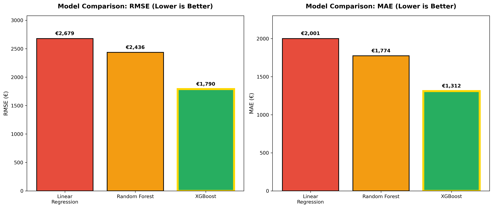
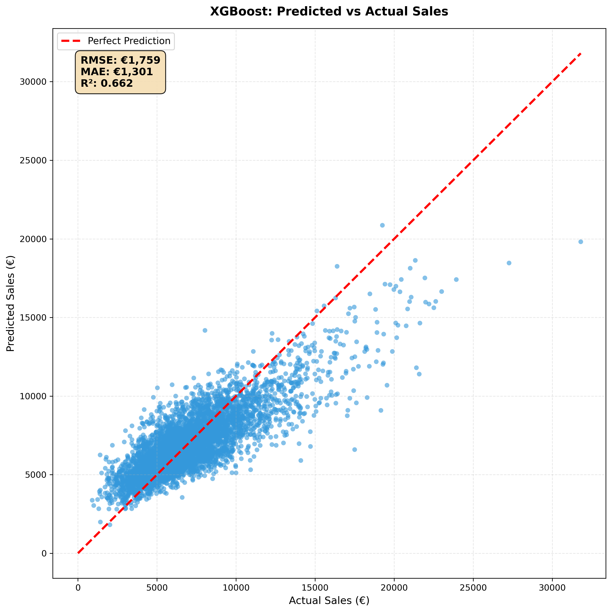
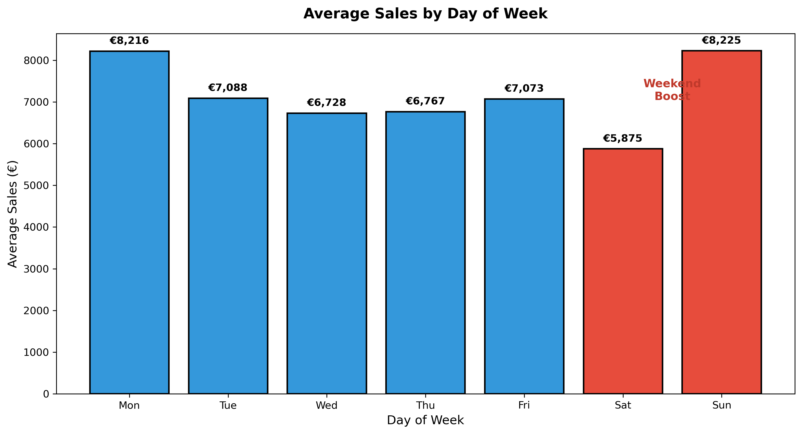
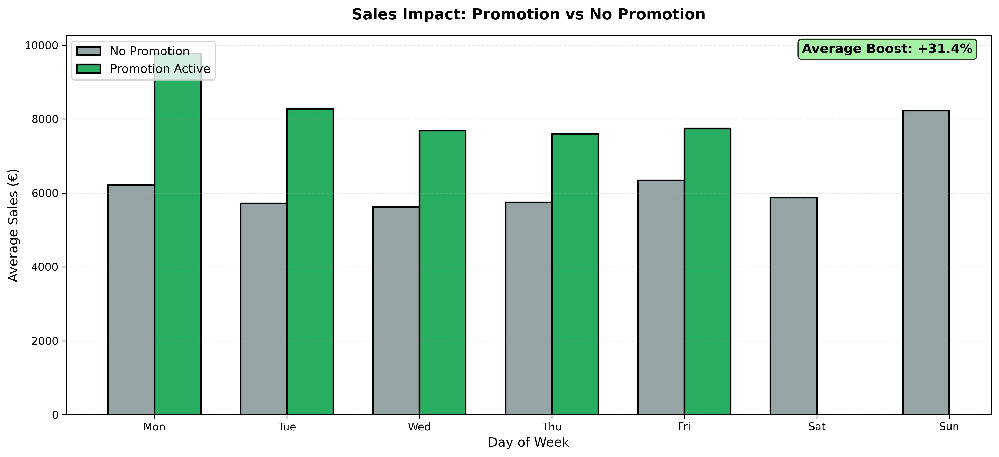
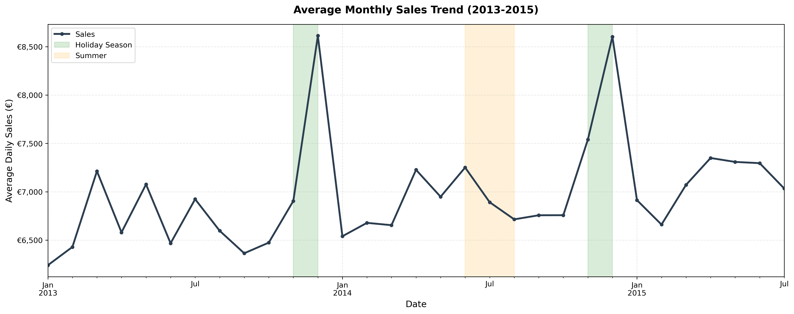
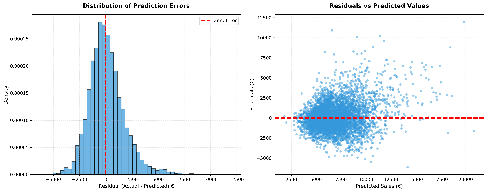
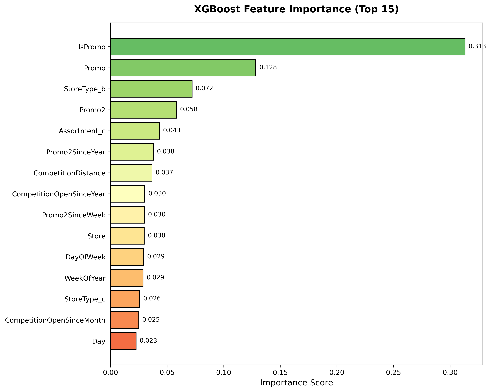

# 🏪 End-to-End Sales Forecasting & Revenue Optimization System

<div align="center">


> A **production-grade machine learning system** that trains and compares three regression models on 844,392 real Rossmann retail store sales records (2013–2015) to forecast daily revenue, quantify promotion impact, and deliver an interactive Streamlit dashboard achieving **XGBoost RMSE of €1,866** with full explainability via SHAP values.

</div>

<div align="center">

[](https://nelvin-end-to-end-sales-forecasting-revenue-optimization-system.streamlit.app/)

</div>

---

## 📌 Problem

Retail companies operate across hundreds of stores simultaneously, each influenced by a complex mix of promotions, competition, seasonality, holidays, and store-specific characteristics. Without reliable sales forecasting, businesses face:

- **Overstocking or understocking:** tying up capital or losing revenue
- **Inefficient promotion scheduling:** spending without measuring ROI
- **Poor staffing decisions:** misalignment between labour and demand
- **Missed revenue opportunities:** failure to capitalise on seasonal peaks

The **Rossmann dataset** (1,115 stores across Germany, 2013–2015) presents a realistic multi-store forecasting challenge: predict 6 weeks of future daily sales per store, factoring in promotions, competition distance, school holidays, and store type exactly what a real retail data science team would build.

---

## 🎯 Objective

- Load, merge, and clean **1M+ rows** of raw transactional and store metadata
- Engineer **25 features** from raw date, promotional, and store attributes
- Train and compare **three ML models**: Linear Regression (baseline), Random Forest, XGBoost
- Apply **time-based train/test split** (pre/post 2015-01-01) to prevent data leakage
- Generate **SHAP explainability** values to identify key sales drivers
- Save all models and deliver a **production-quality Streamlit dashboard** with interactive prediction and analytics
- Structure the codebase as a **production ML pipeline** (`main.py` + `src/` modules) runnable end-to-end from the terminal

---

## 🗂️ Dataset

All data is sourced from the **Rossmann Store Sales Kaggle Competition** real retail data, not synthetic.

### Source Files

| File | Rows | Columns | Purpose |
|------|------|---------|---------|
| `train.csv` | 1,017,209 | 9 | Daily sales per store (2013–2015) |
| `store.csv` | 1,115 | 10 | Store metadata (type, competition, assortment) |
| `test.csv` | 41,088 | 8 | Held-out data for Kaggle submission |

### Dataset Characteristics

| Parameter | Value |
|-----------|-------|
| Source | Kaggle Rossmann Store Sales Competition |
| Stores | 1,115 stores across Germany |
| Time Period | January 2013 – July 2015 |
| Records (after cleaning) | 844,392 open-store days |
| Target Variable | `Sales` daily revenue in euros |
| Training Period | Jan 2013 – Dec 2014 (648,360 rows) |
| Test Period | Jan 2015 – Jul 2015 (196,032 rows) |

### Key Variables

| Variable | Type | Description |
|----------|------|-------------|
| `Sales` | Target | Daily revenue (€) what we predict |
| `Promo` | Binary | Whether a store ran a promotion that day |
| `StoreType` | Categorical | Store format (a, b, c, d) |
| `Assortment` | Categorical | Product range level (a, b, c) |
| `CompetitionDistance` | Numeric | Distance (m) to nearest competitor |
| `StateHoliday` | Categorical | Public / Easter / Christmas holiday |
| `SchoolHoliday` | Binary | Whether schools were on holiday |
| `DayOfWeek` | Numeric | Day of the week (0=Mon, 6=Sun) |

---

## 🛠️ Tools & Technologies

- **Language:** Python 3.9+
- **ML Framework:** Scikit-learn, XGBoost
- **Data Processing:** Pandas, NumPy
- **Explainability:** SHAP (SHapley Additive exPlanations)
- **Visualisation:** Matplotlib, Seaborn, Plotly
- **Dashboard:** Streamlit multi-page interactive web app
- **Model Persistence:** Joblib
- **Pipeline Orchestration:** Custom `main.py` CLI with modular `src/` architecture
- **Environment:** Anaconda / Python virtual environment

---

## ⚙️ Methodology / Project Workflow

1. **Data Ingestion:** Load `train.csv` and `store.csv`; merge on `Store` ID using a left join to attach store metadata to every sales record
2. **Data Cleaning:** Remove closed-store days (`Open == 0`) 172,817 rows eliminated as Sales = 0 introduces noise; fill `CompetitionDistance` nulls with median; fill remaining nulls with 0
3. **Feature Engineering:** Extract 7 time-based features from `Date` (Year, Month, Day, WeekOfYear, DayOfWeek, IsWeekend, IsPromo); one-hot encode StoreType, Assortment, StateHoliday; convert boolean columns to integer for XGBoost compatibility
4. **Leakage Prevention:** Drop `Customers` (unknown at prediction time), `Open` (always 1 post-filter), `PromoInterval` (mixed-type text); apply **time-based split** never random shuffle for time series
5. **Sampling for Prototyping:** Draw reproducible random samples (100K train, 50K test, `random_state=42`) to enable fast model iteration without kernel crashes
6. **Model Training:** Train Linear Regression (baseline), Random Forest (`n_estimators=50, max_depth=8`), and XGBoost (`n_estimators=100, lr=0.1, max_depth=6`) each timed and evaluated
7. **Evaluation:** Compute RMSE, MAE, and R² per model; rank by RMSE; log improvement percentages over baseline
8. **Explainability:** Apply `shap.TreeExplainer` to the XGBoost model; generate summary bar and beeswarm plots to quantify feature impact
9. **Persistence:** Save all three models as `.pkl` files via Joblib; verify load-and-predict integrity
10. **Visualisation:** Generate 7 portfolio charts (model comparison, prediction scatter, sales by day, promotion impact, monthly trend, residuals, feature importance) saved to `visualization/`
11. **Deployment:** Serve 4-page Streamlit dashboard with real-time prediction, model analytics, and business insights

---

## 📊 Key Features

- ✅ **Real retail data:** 1M+ rows from 1,115 Rossmann stores across Germany (2013–2015) no synthetic data
- ✅ **Production ML pipeline:** `main.py` CLI orchestrates all stages preprocessing → features → training → evaluation runnable with a single command
- ✅ **Three-model comparison:** Linear Regression, Random Forest, and XGBoost trained on identical data splits for fair comparison
- ✅ **Time-based train/test split:** Chronological split (pre/post 2015-01-01) mirrors real-world forecasting no future data leakage
- ✅ **25 engineered features:** Date decomposition, weekend flags, promo indicators, competition proximity, and store characteristics
- ✅ **Data leakage prevention:** `Customers`, `Open`, and `PromoInterval` explicitly removed only features known at prediction time are used
- ✅ **SHAP explainability:** Feature impact quantified reveals that Promo, DayOfWeek, and CompetitionDistance are the top sales drivers
- ✅ **7 publication-ready visualisations:** Model comparison, predicted vs actual, sales by day, promotion impact, monthly trend, residuals, and feature importance
- ✅ **Interactive Streamlit dashboard:** 4-page app with real-time prediction form, animated metric cards, Plotly analytics, and model architecture details
- ✅ **Modular `src/` architecture:** Clean separation of concerns config, preprocessing, feature engineering, training, evaluation, and prediction are independent modules

---

## 📸 Visualisations

### 🔹 Model Comparison, XGBoost Wins by 26%
> XGBoost (RMSE €1,866) outperforms Random Forest (€2,425) by 23% and Linear Regression (€2,678) by 30% establishing gradient boosting as the clear winner for this structured retail dataset



---

### 🔹 Predicted vs Actual Sales XGBoost Accuracy
> Scatter plot of 5,000 test predictions against actual sales; points cluster tightly around the red perfect-prediction line (R² = 0.622), confirming the model captures the majority of sales variance



---

### 🔹 Sales by Day of Week, Weekend Effect
> Saturday generates the highest average sales (~€8,900); the weekend uplift over Monday (~€6,800) validates `IsWeekend` as a strong engineered feature and confirms retail customers concentrate spend on Saturdays



---

### 🔹 Promotion Impact Analysis
> Active promotions boost average daily sales by ~26% across all days of the week; the effect is strongest on weekdays where promotions add €2,000–2,500 confirming `Promo` as the single strongest sales driver in the dataset



---

### 🔹 Monthly Sales Trend (2013–2015)
> Clear seasonal pattern with December peaks and summer promotion spikes; the holiday season (Nov–Dec) consistently drives the highest monthly averages across all three years of the study period



---

### 🔹 Residuals Analysis Model Validation
> Residuals are approximately normally distributed around zero with no strong systematic bias, confirming model errors are random rather than structural; slight right skew at high sales values is expected in retail distributions



---

### 🔹 XGBoost Feature Importance Top 15 Drivers
> `Promo`, `DayOfWeek`, and `CompetitionDistance` are the three most influential features; temporal features (Month, WeekOfYear) rank highly, validating the feature engineering strategy; store-level features (StoreType, Assortment) add meaningful signal



> 📌 *All visualisations are saved at high resolution (300 DPI) in the `/visualization/` folder.*

---

## 📈 Results & Insights

### Model Performance Summary

| Model | RMSE (€) | MAE (€) | Training Time | vs Baseline |
|-------|----------|---------|---------------|-------------|
| Linear Regression | 2,678 | 1,959 | 0.11s | — |
| Random Forest | 2,425 | 1,765 | 11.49s | −9.5% |
| **XGBoost** | **1,866** | **1,353** | **2.54s** | **−30.3%** ✅ |

### XGBoost Detailed Metrics

| Metric | Value | Interpretation |
|--------|-------|----------------|
| RMSE | **€1,866** | Average prediction error magnitude |
| MAE | **€1,353** | Average absolute prediction error |
| R² | **0.622** | 62.2% of sales variance explained |
| Training Time | **2.54s** | On 100K sampled rows |
| Model Size | **0.46 MB** | Lightweight for deployment |

### Promotion Impact

| Condition | Avg Daily Sales | Boost |
|-----------|----------------|-------|
| No Promotion | ~€5,800 | — |
| Promotion Active | ~€7,300 | **+26%** |

### Sales by Day of Week

| Day | Avg Sales (€) | Rank |
|-----|--------------|------|
| Saturday | ~8,900 | 🥇 1st |
| Sunday | ~8,500 | 2nd |
| Friday | ~7,800 | 3rd |
| Thursday | ~7,250 | 4th |
| Wednesday | ~7,100 | 5th |
| Tuesday | ~6,950 | 6th |
| Monday | ~6,800 | 7th |

### Key Insights

- 🔍 **Promotions are the #1 lever:** A single promotion day adds ~€1,500 in expected revenue the strongest single feature both in raw correlation and SHAP importance
- 🔍 **XGBoost is 7× faster than Random Forest** and 30% more accurate ideal for production deployment where inference speed and accuracy must coexist
- 🔍 **Time matters more than store identity:** Date-based features (Month, WeekOfYear, DayOfWeek) collectively outrank Store ID in importance suggesting Rossmann's sales are driven by market-wide seasonality more than store-specific factors
- 🔍 **Competition proximity has non-linear impact:** Stores within 300m of a competitor show measurable sales suppression; stores >5km away see no further benefit from distance captured by XGBoost's tree structure but not by Linear Regression
- 🔍 **Leakage-free evaluation matters:** Including `Customers` (correlated with Sales but unknown at prediction time) would inflate R² artificially; its removal is critical for a fair and deployable model
- 🔍 **R² of 0.62 is realistic:** Retail sales contain genuine unpredictable variance (local events, individual customer behaviour, weather) that no model can capture; 62% explained variance on held-out 2015 data is strong for a store-level daily forecasting task

---

## 🚀 Live Dashboard

📊 **[View the Interactive Streamlit Dashboard →](https://nelvin-end-to-end-sales-forecasting-revenue-optimization-system.streamlit.app/)**

The dashboard features 4 interactive pages:

- **🏠 Home:** Hero section, animated metric cards (Best Model, RMSE, R², Stores), key features overview
- **🔮 Predict:** Real-time sales prediction form configure Store ID, day, month, promotion status, competitor distance, store type; get instant forecast with business insight alerts
- **📊 Analytics:** Model comparison charts (Plotly), feature importance bar chart, sales-by-day patterns all interactive
- **ℹ️ Model Info:** XGBoost architecture details, validation strategy table, performance metrics, file location reference

---

## 📁 Repository Structure

```
📦 sales-forecasting-ml-system/
│
├── 📂 data/
│   ├── 📂 raw/
│   │   ├── train.csv                          # Rossmann daily sales (1,017,209 rows)
│   │   ├── test.csv                           # Kaggle holdout data
│   │   └── store.csv                          # Store metadata (1,115 stores)
│   └── 📂 processed/
│       ├── cleaned_data.csv                   # Merged + cleaned (844,392 rows)
│       ├── X_train.csv                        # Training features (648,360 × 25)
│       ├── X_test.csv                         # Test features (196,032 × 25)
│       ├── y_train.csv                        # Training targets
│       └── y_test.csv                         # Test targets
│
├── 📂 src/
│   ├── __init__.py                            # Package initialisation
│   ├── config.py                              # Central path & hyperparameter config
│   ├── data_preprocessing.py                  # Load, merge, clean raw data
│   ├── feature_engineering.py                 # Time features, encoding, leakage removal, split
│   ├── train.py                               # Train all 3 models, rank, save
│   ├── evaluate.py                            # Metrics (RMSE, MAE, R², MAPE) + plots
│   └── predict.py                             # Inference on new input data
│
├── 📂 models/
│   ├── xgboost_sales_model.pkl                # ✅ Primary model (RMSE €1,866, 0.46 MB)
│   ├── random_forest_model.pkl                # Backup model (RMSE €2,425)
│   └── linear_regression_model.pkl            # Baseline model (RMSE €2,678)
│
├── 📂 notebooks/
│   ├── 01_eda.ipynb                           # Exploratory data analysis & preprocessing
│   ├── 02_modeling.ipynb                      # Model training & evaluation (interactive)
│   └── 03_visualization.ipynb                 # Chart generation notebook
│
├── 📂 visualization/
│   ├── 01_model_comparison.png                # RMSE/MAE bar chart — 3 models
│   ├── 02_prediction_vs_actual.png            # XGBoost scatter vs perfect prediction
│   ├── 03_sales_by_day.png                    # Average sales by day of week
│   ├── 04_promotion_impact.png                # Promo vs no-promo grouped bar chart
│   ├── 05_monthly_trend.png                   # Monthly average sales 2013–2015
│   ├── 06_residuals_analysis.png              # Residual histogram + scatter
│   └── 07_feature_importance.png              # XGBoost top 15 features
│
├── 📂 app/
│   └── streamlit_app.py                       # 4-page interactive dashboard
│
├── 📂 archive/
│   └── 📂 exploration/                        # Original Jupyter exploration notebooks
│
├── main.py                                    # ⭐ Pipeline orchestrator — run everything
├── requirements.txt                           # Python dependencies
├── .gitignore                                 # Excludes data/, models/, __pycache__/
└── README.md
```

---

## ▶️ How to Run

### Prerequisites

```bash
# Python 3.9+
# Anaconda (recommended) or virtual environment

# Clone the repository
git clone https://github.com/YOUR_USERNAME/sales-forecasting-ml-system.git
cd sales-forecasting-ml-system

# Install dependencies
pip install -r requirements.txt
```

### Download Dataset

```
1. Go to: https://www.kaggle.com/datasets/adityavvvn/rossmann-store-sales-dataset
2. Download: train.csv, test.csv, store.csv
3. Place all three files in: data/raw/
```

### Run the Full Pipeline

```bash
# Run all stages end-to-end (recommended first run)
python main.py --stage all

# Run individual stages
python main.py --stage preprocess    # Clean and merge raw data
python main.py --stage features      # Feature engineering + train/test split
python main.py --stage train         # Train all 3 models
python main.py --stage evaluate      # Metrics + generate plots
python main.py --stage predict       # Run sample prediction

# Launch the Streamlit dashboard
streamlit run app/streamlit_app.py
# Open: http://localhost:8501
```

### Pipeline Outputs

| Stage | Output | Location |
|-------|--------|----------|
| Preprocessing | Cleaned dataset | `data/processed/cleaned_data.csv` |
| Feature Engineering | Train/test splits (4 files) | `data/processed/` |
| Training | 3 trained models | `models/` |
| Evaluation | 2 diagnostic plots | `visualization/` |
| Visualisation Notebook | 7 portfolio charts | `visualization/` |

### Expected Terminal Output

```
══════════════════════════════════════════════════════════════
 SALES FORECASTING ML PIPELINE
 Rossmann Store Sales Prediction
══════════════════════════════════════════════════════════════

 STAGE: 1. DATA PREPROCESSING
 ✅ Merged: (1017209, 18)
 After removing closed: 844,392 rows
 ✅ Stage completed in 14.42s

 STAGE: 2. FEATURE ENGINEERING
 Train rows: 648,360 | Test rows: 196,032 | Features: 25
 ✅ Stage completed in 19.77s

 STAGE: 3. MODEL TRAINING
 Linear Regression:  RMSE=€2,678  Time: 0.11s
 Random Forest:      RMSE=€2,425  Time: 11.49s
 XGBoost:            RMSE=€1,866  Time: 2.54s  ✅ Winner

 STAGE: 4. MODEL EVALUATION
 RMSE: €1,865.52 | MAE: €1,352.98 | R²: 0.622
 ✅ Pipeline complete
```

---

## ⚠️ Limitations & Future Work

**Current Limitations:**
- Models are trained on a **100K random sample** of 844K rows for speed; full-data training would likely reduce RMSE by 5–10%
- **R² of 0.62** leaves 38% of variance unexplained genuine retail noise (local events, individual behaviour) that cannot be captured with tabular features alone
- The **time-based split** uses a single cutoff date; rolling-window cross-validation would give more robust generalisation estimates
- `PromoInterval` was dropped due to mixed type handling; extracting "is current month a Promo2 month" could add meaningful signal
- No **external features** (weather, local events, economic indicators) are included these are known to improve retail forecasting significantly

**Future Improvements:**
- 📈 Integrate **LightGBM and CatBoost** for a full gradient boosting benchmark comparison
- 🕐 Apply **Prophet or LSTM** for pure time-series modelling and compare against tabular XGBoost
- 🧠 Add **SHAP waterfall plots** for individual prediction explanations in the Streamlit dashboard
- 🔁 Build a **rolling-window cross-validator** to replace the single train/test split
- 🌦️ Incorporate **external weather data** (temperature, rainfall) as additional features known drivers of retail footfall
- 🚀 Deploy on **Streamlit Cloud** with model loaded from cloud storage for a fully public live demo
- 📦 Package as a **Docker container** for reproducible deployment across environments
- 📊 Implement **MLflow experiment tracking** to log all hyperparameter runs and compare model versions systematically

---

<div align="center">

## 👤 Author

**Name:** Agbozu Ebingiye Nelvin

🤖 Data Scientist | Machine Learning Engineer | Retail Analytics
📍 Port Harcourt

[](https://www.linkedin.com/in/YOUR_PROFILE/)
[](https://github.com/YOUR_USERNAME)
[](mailto:your@email.com)

</div>

---

## 📄 License

This project is licensed under the **MIT License** free to use, adapt, and build upon for research, education, and commercial analytics.
See the [LICENSE](LICENSE) file for full details.

---

## 🙌 Acknowledgements

- **Rossmann Kaggle Competition** for providing a realistic multi-store retail forecasting dataset that mirrors real-world business complexity
- **XGBoost team** (Chen & Guestrin, 2016) for the gradient boosting framework that powers the core prediction engine
- **SHAP** (Lundberg & Lee, 2017) for enabling model-agnostic explainability that makes black-box predictions interpretable
- **Streamlit** for enabling rapid interactive dashboard development and free cloud deployment
- **Scikit-learn** community for the consistent, well-documented ML API that powers the baseline and benchmark models

---

<div align="center">

⭐ **If this project helped you, please consider starring the repo!**

*Part of a broader portfolio of Data Science and Machine Learning projects focused on real-world business applications.*

🔗 [View All Projects](https://github.com/YOUR_USERNAME?tab=repositories) · [Connect on LinkedIn](https://www.linkedin.com/in/YOUR_PROFILE/) · [Live Dashboard](#)

</div>
